# ClaimPilot — the whole system explained

> [!info] How to use this in Obsidian
> Open the repository folder as a vault (File → Open folder as vault), or copy this file into any vault. Every diagram is Mermaid — Obsidian renders it in "Reading view". Sections are ordered like a story for a video walkthrough.

---

## 0. One-sentence pitch

ClaimPilot is a **multi-agent AI co-pilot for insurance claim adjudication**: four LLM agents read the *right version* of a policy and decide *what* the rules say, a **deterministic (rule, zero-LLM) engine computes the money**, a human supervisor **must approve** before anything is final, and every step is **traceable and auditable**.

The mountain in one line:

```text
"Who reads things" = AI (agents, retrieval, drafting)
"Who does the math" = deterministic engine  <- the ONLY thing that can touch money
"Who says it's final" = a human (Supervisor role)
```

---

## 1. The mental model (tell this story)

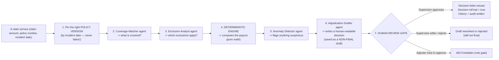

> [!important] 
> **Nothing is ever final without a human.** The `draft_adjudication` tool persists a draft *"Draft decision saved but NOT final. Awaiting human approval."* The system is explicitly designed so a fully autonomous pass can only ever produce a recommendation.

---

## 2. Big-picture architecture (Clean Architecture)

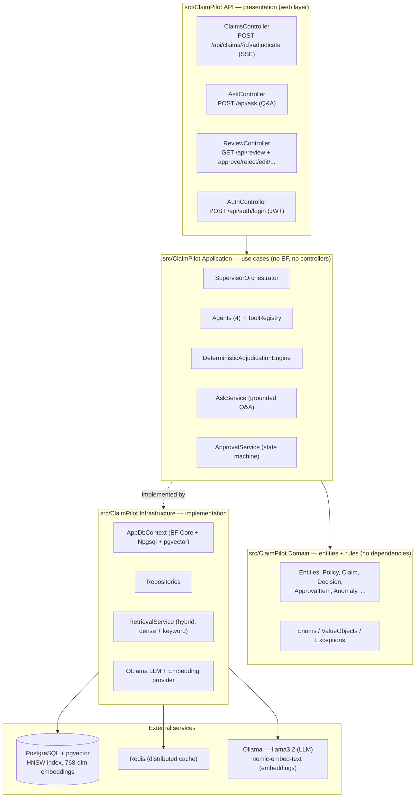

**Dependency rule:** Domain knows nothing. Application depends on Domain and on *interfaces* defined in `Application/Interfaces`. Infrastructure implements those interfaces. The API wires everything together in `Program.cs`.

---

## 3. Runtime topology (how it's deployed)

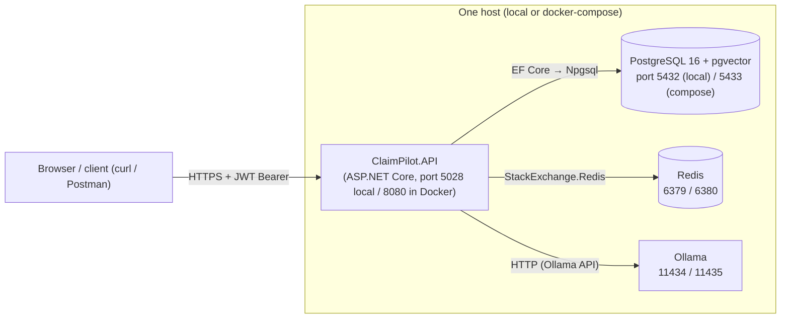

- The same API binary runs locally and in Docker — the compose file merely remaps host ports so both stacks can coexist.
- LLM calls go **out** to Ollama (no cloud API): `llama3.2` answers, `nomic-embed-text` produces the 768-dim vectors that pgvector indexes.

---

## 4. The live story: Sequence diagram of an adjudication

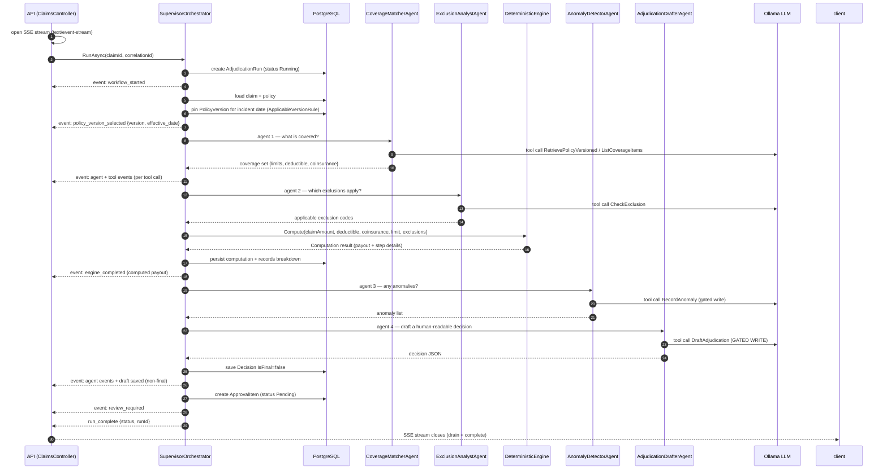

**How SSE works (ClaimsController, 82–140):** a `System.Threading.Channels.Channel` bridges the orchestrator's `EventRaised` C# event to the HTTP response; a drain task writes each serialized event (`event: <name>\ndata: {...}\n\n`) and flushes. The catch-all guarantees `event: error` is still sent on failure.

---

## 5. The four agents and their tools

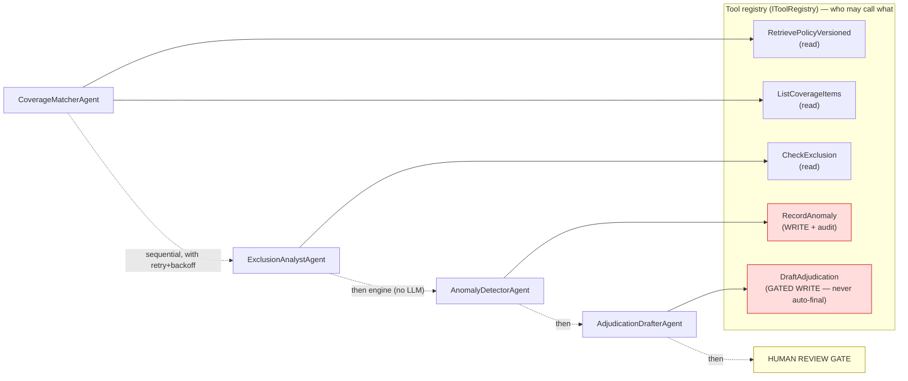

| Agent | Job | Tools it may call |
|---|---|---|
| Coverage Matcher | "What does this policy *cover* for this claim type?" | `RetrievePolicyVersioned`, `ListCoverageItems` |
| Exclusion Analyst | "Which exclusions apply to this loss cause?" | `CheckExclusion` |
| (Deterministic Engine) | **Computes the payout — no LLM** | *none* |
| Anomaly Detector | "Is anything unusual (pending docs, variance, suspicious pattern)?" | `RecordAnomaly` |
| Adjudication Drafter | "Write a decisions-style recommendation a human can read." | `DraftAdjudication` |

- The **orchestrator** (SupervisorOrchestrator) runs the agents **in order**, wraps each in retry + exponential backoff (default: 3 tries, 500 ms base), enforces an **iteration cap** and a **5-minute run timeout**, and subscribes to the event sink.
- **Fallback:** if orchestration fails, it degrades to *safe plain RAG* rather than inventing an answer.

---

## 6. The deterministic engine — where the money math lives

This is the **only component allowed to touch money**. It's a pure function: same inputs ⇒ same output (tests assert determinism).

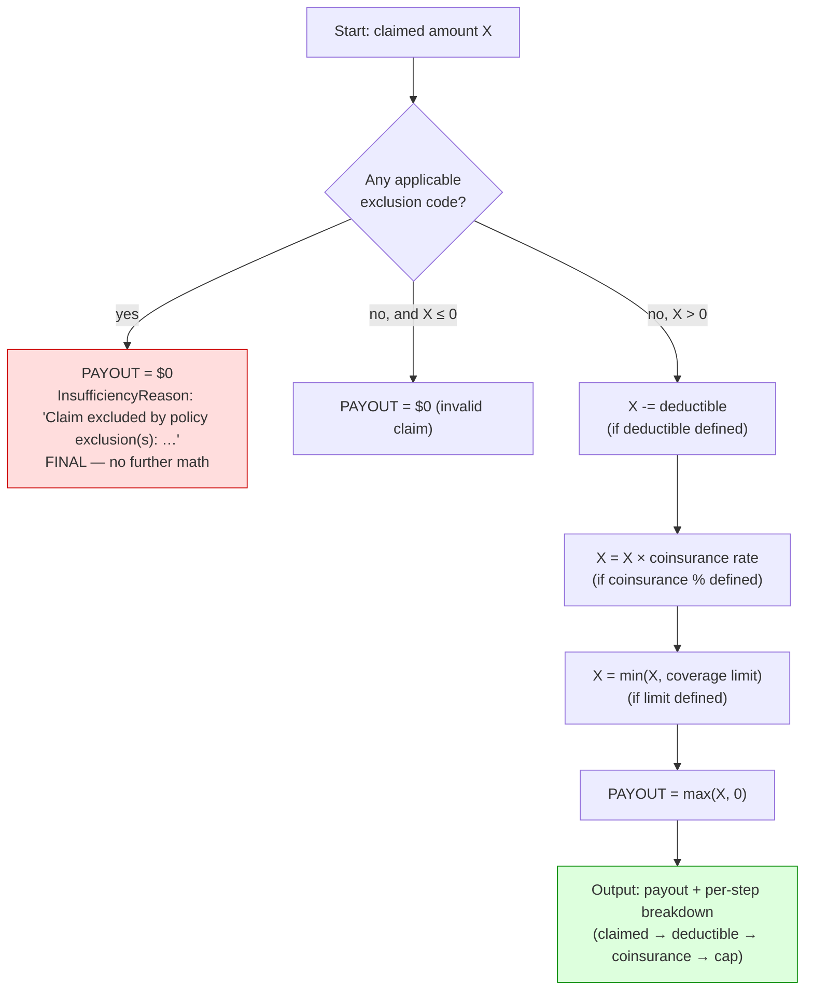

**Worked example on the seed corpus:**

| Claim | Incident | Pinned version | Math | Payout |
|---|---|---|---|---|
| CLAIM-2023-001 (AUT-2022) | 2023 | **v1** (limit $5,000, deductible $500) | 6200 − 500 = 5700 → min(5700, 5000) | **$5,000** |
| CLAIM-2026-001 (AUT-2022) | 2026 | **v2** (limit $10,000, deductible $600) | 7800 − 600 = 7200 → min(7200, 10000) | **$7,200** |

> [!tip] Version-trap design
> The same policy has two versions. v2 has a **higher** limit ($10k). If the system naively used "latest version", CLAIM-2023-001 would wrongly pay $9,500 under v2. The `ApplicableVersionRule` selects the version whose `EffectiveDate` is **≤ the incident date** (never "newest"), so the 2023 claim correctly pays only $5,000. Live E2E and unit tests both verify this.

---

## 7. Grounded Q&A (`/api/ask`) — the refusal guard

The ask flow answers policy questions but **refuses** anything the policy can't back up (anti-hallucination).

```mermaid
flowchart TD
    Q["Question + policy number + incident date (AskController)"] --> PIN["Pin policy version<br/>(same ApplicableVersionRule)"]
    PIN --> RETR["Hybrid retrieval over that version's chunks"]
    RETR --> SUF{Sufficient evidence<br/>(retrieved context)?}
    SUF -- "no" --> REF["Return EXACT refusal string"]
    SUF -- "yes" --> LLM["LLM answers questions (not money)"]
    LLM --> N{Answer mentions<br/>a number/payout?}
    N -- "number NOT found in corpus" --> REF2["Refuse with EXACT string"]
    N -- "number IS grounded in corpus" --> OK["Answer passed through"]

    style REF fill:#fdd,stroke:#c00
    style REF2 fill:#fdd,stroke:#c00
    style OK fill:#dfd,stroke:#080
```

The exact refusal string is a constant:
```text
Not enough information in the policy corpus to determine this.
```
Prompt-injection text inside an excerpt is treated as **data, not instructions** — if an adversarial chunk tries to "coax" a different payout, the groundedness check refuses (`GroundednessChecks.ContainsUnsupportedNumbers` scans the answer tokens for numbers absent from the retrieved chunks).

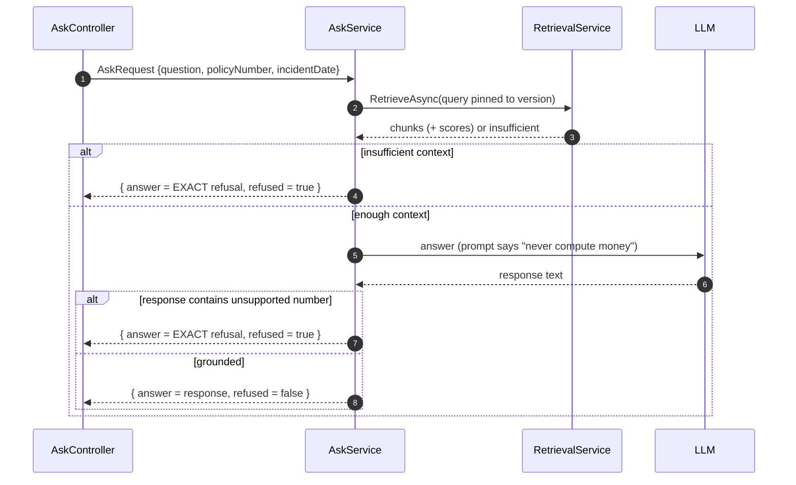

---

## 8. Hybrid retrieval — dense vectors + keywords fused

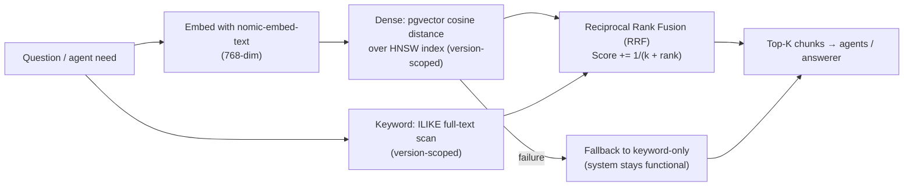

- **Failure handling:** if dense retrieval throws (e.g. missing embedding), the service logs it, falls back to keyword-only, and only surfaces an error if *both* paths return nothing.
- Chunks carry one embedding each and belong to a `PolicyVersion`, so **retrieval is always version-scoped** — a 2023 question never sees 2026 clauses.

---

## 9. Data model (the entities)

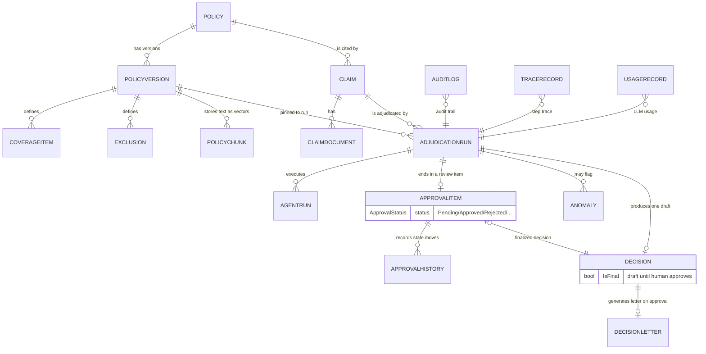

All persisted via EF Core + Npgsql in `AppDbContext` (16 tables). `DecisionLetters` describe *how* and store the amount text issued to the customer.

---

## 10. Human review workflow (state machine)

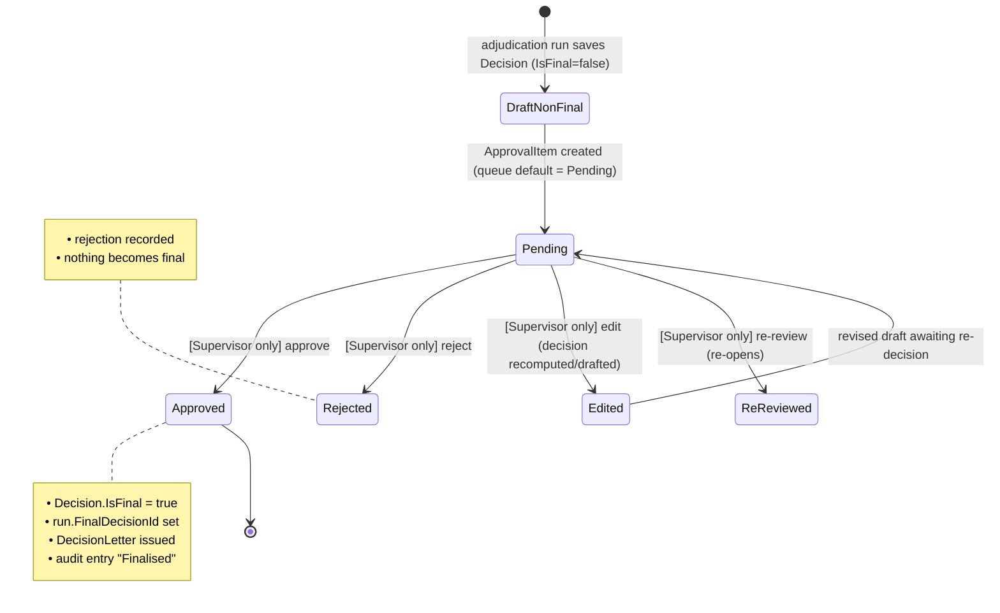

- The queue endpoint is `GET /api/review` and **defaults to Pending** when no status filter is given.
- **Role gating:** approve/reject/edit/re-review/assign/escalate/priority are all `[Authorize(Roles = "Supervisor")]`. An Adjuster attempting to approve gets **403** (verified in E2E). Queue listing is available to Adjuster + Supervisor; Viewer is read-only.

---

## 11. Security, roles, and audit

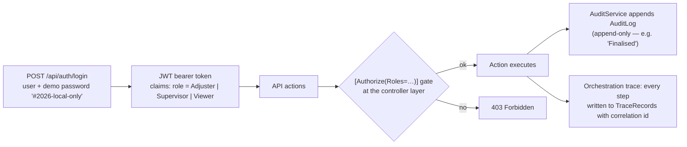

---

## 12. Code map — where everything lives

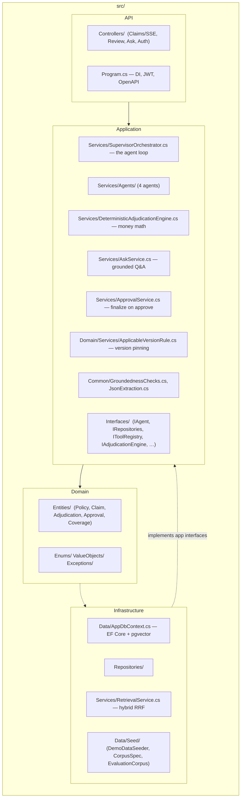

Key files and what to point at in the video:
| File | Say this |
|---|---|
| `Application/Services/SupervisorOrchestrator.cs` | The conductor: version pinning, agent order, engine, review gate, retries/timeouts |
| `Application/Services/DeterministicAdjudicationEngine.cs` | The trust anchor: pure math, no LLM, fully unit-tested |
| `Application/Interfaces/Orchestration/IAgent.cs` | The tool contract — `ToolName` enum + gated-write flags (`IsWrite`, `IsGatedWrite`, `RequiresAudit`) |
| `Application/Services/Agents/AdjudicationDrafterAgent.cs` | The drafter that only ever writes a **non-final** draft |
| `Domain/Services/ApplicableVersionRule.cs` | Why 2023 ≠ 2026 payouts on the same policy |
| `Infrastructure/Services/RetrievalService.cs` | Dense (pgvector/HNSW) + keyword + RRF fusion, version-scoped |
| `API/Controllers/ClaimsController.cs` | SSE endpoint that streams live agent activity |
| `API/Controllers/ReviewController.cs` | The human gate; Supervisor-only actions |
| `Data/Seed/EvaluationCorpus.cs` | The 26-case eval dataset incl. version traps + injection cases |

---

## 13. Tests (what proves it works)

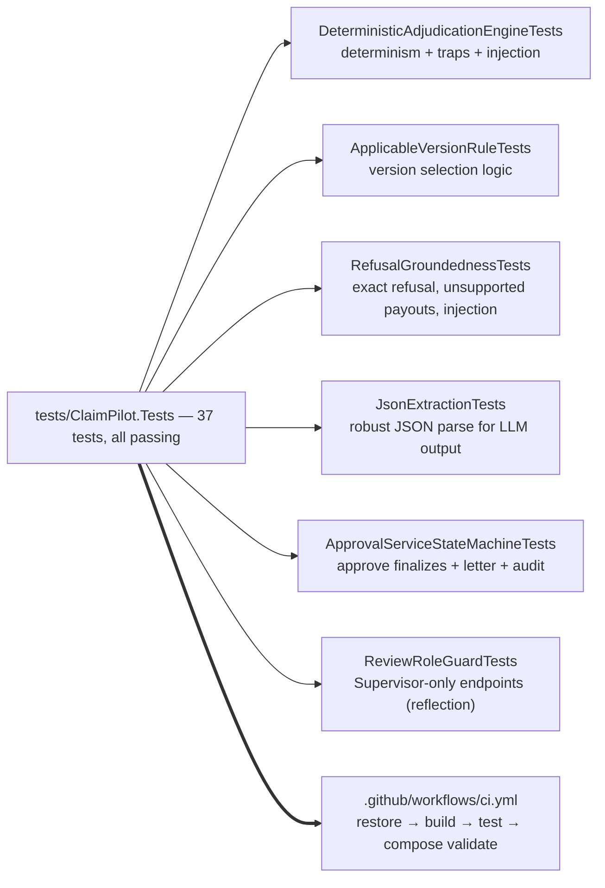

---

## 14. The non-negotiables (design invariants)

> [!warning] 8 rules the whole design obeys
> 1. **The LLM never computes money.** Only `DeterministicAdjudicationEngine` does. The engine has no LLM dependency.
> 2. **Version is pinned by incident date, never "latest".** `ApplicableVersionRule`; retrieval is version-scoped.
> 3. **Refusal string is exact and constant**: `Not enough information in the policy corpus to determine this.`
> 4. **`draft_adjudication` is a gated write.** It persists `IsFinal=false`; only a Supervisor approval flips it true.
> 5. **Roles are enforced server-side** (`Supervisor` for finalizing), not just in the UI.
> 6. **Audit + trace are append-only** records of every step and decision.
> 7. **No secrets in the repo** (`.env` is gitignored; the seed login is a documented demo-only password).
> 8. **Determinism is tested** — same inputs, same payout, every time.

---

## 15. How to run it (cheat sheet)

```bash
# Local dev (already up): Postgres+pgvector, Redis, Ollama
dotnet run --project src/ClaimPilot.API            # http://localhost:5028

# Containerized stack (docker-compose.yml): remaps ports to 5433/6380/11435/8080
docker compose up -d --build                       # http://localhost:8080

# Tests
dotnet test tests/ClaimPilot.Tests/ClaimPilot.Tests.csproj   # 37 passing

# Demo users (local seed): adjuster / supervisor / viewer
# password for all: #2026-local-only  (POST /api/auth/login)
```

---

## 16. Glossary

| Term | Meaning |
|---|---|
| Adjudication Run | One full pass over a claim: version pin → agents → engine → draft → review item |
| Agent | An LLM-driven worker with a narrow job + a fixed set of tools |
| Tool | A capability the agent can invoke; writes are flagged and gated |
| Gated write | A tool that persists but never finalizes (needs human approval) |
| Policy version | A snapshot of a policy's terms with an `EffectiveDate` |
| Deterministic engine | Pure calculation of payout from policy numbers + claim amount |
| Review item / ApprovalItem | The human queue record created for each completed run |
| Groundedness | Guard that an answer's numbers actually come from the retrieved corpus |
| RRF | Reciprocal Rank Fusion — combining dense + keyword ranked lists |
| SSE | Server-Sent Events — the live stream of agent activity to the browser |